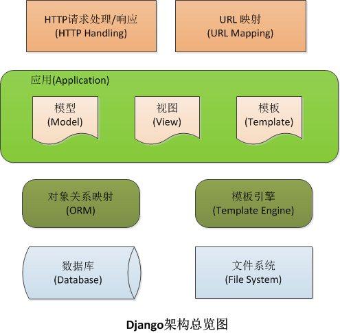

## 1.Django入门
- 视频:
- 官网
    - https://www.djangoproject.com/
    - 中文文档1.8 https://wizardforcel.gitbooks.io/django-chinese-docs-18/content/
    - Django 提供了通用Web开发模式的高度抽象，提供了频繁进行的编程作业的快速解决方法，以及为“如何解决问题”提供了清晰明了的约定。 同时，Django 尝试留下一些方法，来让你根据需要在framework之外来开发。
- Django框架总览图
    - 
    - 


- 安装django-2.0
    - pip install django
- 建立 Django 工程     
    - django-admin startproject  tutorial  
    - cd tutorial
    - 迁移数据库 python manage.py migrate
    - 启动服务器 python manage.py runserver
    - 修改Django 默认的语言为中文
```bash
vi tutorial/settings.py
#LANGUAGE_CODE = 'en-us'
# 把英文改为中文
LANGUAGE_CODE = 'zh-hans'

#TIME_ZONE = 'UTC'
# 把国际时区改为中国时区
TIME_ZONE = 'Asia/Shanghai'
```    
    
    
```bash
(.py3) pro:django play$ django-admin startproject  tutorial
(.py3) pro:django play$ tree
.
└── tutorial
    ├── manage.py
    └── tutorial
        ├── __init__.py
        ├── settings.py
        ├── urls.py
        └── wsgi.py

2 directories, 5 files

(.py3) pro:django play$ cd tutorial/

(.py3) pro:tutorial play$ python manage.py migrate
Operations to perform:
  Apply all migrations: admin, auth, contenttypes, sessions
Running migrations:
  Applying contenttypes.0001_initial... OK
  Applying auth.0001_initial... OK
  Applying admin.0001_initial... OK
  Applying admin.0002_logentry_remove_auto_add... OK
  Applying contenttypes.0002_remove_content_type_name... OK
  Applying auth.0002_alter_permission_name_max_length... OK
  Applying auth.0003_alter_user_email_max_length... OK
  Applying auth.0004_alter_user_username_opts... OK
  Applying auth.0005_alter_user_last_login_null... OK
  Applying auth.0006_require_contenttypes_0002... OK
  Applying auth.0007_alter_validators_add_error_messages... OK
  Applying auth.0008_alter_user_username_max_length... OK
  Applying auth.0009_alter_user_last_name_max_length... OK
  Applying sessions.0001_initial... OK
(.py3) pro:tutorial play$ python manage.py runserver
Performing system checks...

System check identified no issues (0 silenced).
March 19, 2018 - 11:32:04
Django version 2.0.3, using settings 'tutorial.settings'
Starting development server at http://127.0.0.1:8000/
Quit the server with CONTROL-C.
[19/Mar/2018 11:32:09] "GET / HTTP/1.1" 200 16348
```    